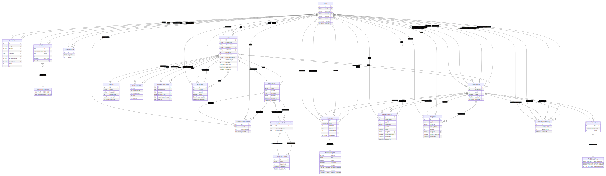

# POTZ

위치기반 소규모 공동체 배달비 더치페이 서비스

## 프로젝트 기간

2023-11-01 ~

## Tech Stack

- FE : React,
- BE : Express, MySQL, Prisma

## How to Run

### 프로젝트 처음 세팅하는 경우

1.  set env

    `.env.example` 파일을 복사해서 파일명을 `.env`로 변경하고 해당 항목의 환경변수 값을 세팅

    ```bash
    cd server
    cp .env.example .env
    ```

2.  run mysql with Docker

    2-1. docker compose 실행

    ```bash
     cd server
     docker compose up -d
    ```

    2-2. prisma migration 실행

    ```bash
    npx prisma migrate deploy
    ```

    > 보류 중인 모든 마이그레이션을 적용하고 데이터베이스가 없는 경우 데이터베이스를 생성합니다.

    2-3. prisma seeding 실행

    ```bash
    npx prisma db seed
    ```

### RUN

1.  run server

    ```bash
    cd server
    npm install
    npm run dev
    ```

2.  run client

    ```bash
    cd client
    npm install
    npm run dev
    ```

## ERD



## prisma 모델 schema를 변경한 경우

schema를 변경한 경우에는 마이그레이션을 생성해야합니다.

```bash
npx prisma migrate dev --name [마이그레이션명]
```

from [Using Prisma Migrate](https://www.prisma.io/docs/getting-started/setup-prisma/start-from-scratch/relational-databases/using-prisma-migrate-node-mysql)

## 팀원이 변경한 schema 적용하기

```bash
npx prisma migrate dev
```

from [Example: Incorporating your team's changes](https://www.prisma.io/docs/guides/migrate/developing-with-prisma-migrate/team-development)

## Seed database

[seed script](./server/prisma/seed.js)에 정의되어 있는 개발에 필요한 기본 데이터들을 db에 추가합니다.

```bash
npx prisma db seed
```

from [Seeding your database](https://www.prisma.io/docs/guides/migrate/seed-database)

## 개발환경 DB를 reset 하는 방법

‼️ 꼭 개발환경에서만 사용 ‼ ️

```bash
npx prisma migrate reset
```

위 명령어는 아래와 같은 일을 합니다.

1. database를 drop한다.<br>
   (database 삭제를 허용하지 않는 환경에서는 soft reset)
2. db가 drop된 경우, drop된 database를 같은 이름으로 새로 만든다.
3. 모든 migrations를 적용한다.
4. seed script를 실행시킨다.

→기존 DB의 데이터를 모두 삭제하고, 모든 마이그레이션 실행 후, seed 실행

from [Reset the development database](https://www.prisma.io/docs/concepts/components/prisma-migrate/migrate-development-production?query=reset&page=1#reset-the-development-database)

## Prisma Studio 열기

Prisma Studio를 이용해서 DB를 웹브라우저 UI로 확인할 수 있습니다(CRUD 가능)

```bash
npx prisma studio
```
